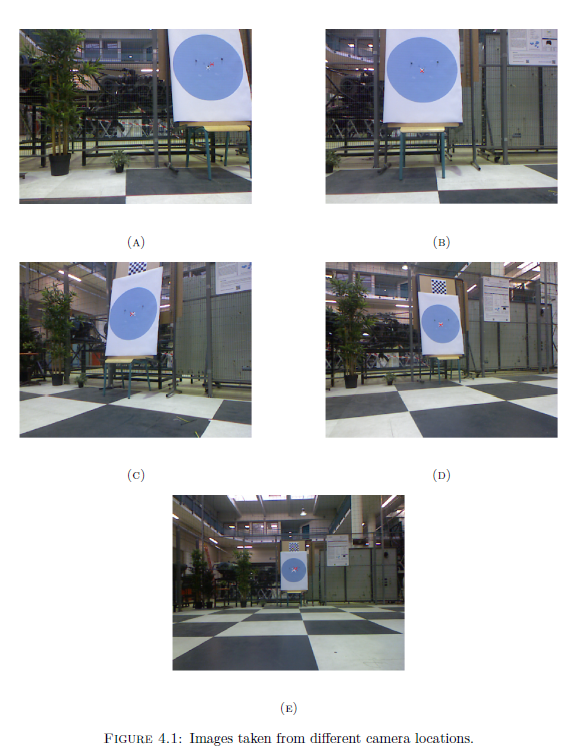

## Structure_from_Motion-SfM-
 [Experimental Results (SfM)](https://www.youtube.com/watch?v=dKgOxqXGPS4&list=PLWg0Iqn2Q4SG88FVElzByj8Zt-VG_t_fO)

### Experiment result

To validate the proposed approach experimentally, images captured from a Kinect camera, fixed on the top of a TurtleBot platform, are used offline for point depth estimation. The estimated variables are compared to the ground truth data collected using the indoor positioning tool Vicon Motion Capture that supports Virtual Reality Peripheral Networks (VRPN). The robotic platform runs on the base of a noise measurements zed wheel. It integrates wheel encoders, large lithium batteries, wheel drop sensors, and the Asus Xtion pro sensor mounted on the robot. The robot acts as a slave to a master PC on which the program is executed. All communications are managed by a master node, which is responsible for the interconnection protocol between the nodes using topics
that would be available to subscribe to or to publish. The Vicon Motion Capture setup ensures tracking and recording with an accuracy of one millimeter. The odometry data of moving objects over a volume using nine infrared cameras with a high frame rate reaches more than 120 fps.

The setup involves a Windows machine that runs Vicon Tracker 3.7, connected through a switch to another machine running Ubuntu 16.04 with ROS Kinetic installed, which is the master machine that captures Kinect data and Vicon messages. The machine has vrpn_client_ros package installed which has a ROS node client for VRPN that publishes the Vicon data of the tracked point on the circle as well as Kinect sensor fixed to the TurtleBot. The robot and the master machine are connected to the same network using a router, and communications are held via an SSH protocol.
After calibrating the Vicon Motion Capture system, the Kinect fixed on the turtleBot and the center of the image circle are recognized by the Vicon system using mounted markers. These operations are achieved using Vicon Tracker 3.7. Vicon data (ground truth) are published to the ROS network and saved as bag files created with the rosbag utility provided by ROS. Images are published in the ROS environment at about 30Hz and Vicon data are updated with 100 Hz.
Positions of the marker attached to the center of the circle and the one attached to the Kinect camera are recorded in the Vicon fixed reference frame. Let pc{v} = (Xc{v} Yc{v} Zc{v})^T the position of the marker attached to the circle and pk{v} = (Xk{v} Yk{v} Zk{v})^T the position of Kinect camera with respect to the Vicon-fixed frame. Our aim is to build a ground truth consisting of circle center positions with respect to the camera frame. Hence, position of marker pc{v} can be expressed in the camera frame with coordinates pck as follows:
                                                   
                         pck = inv({k}R{v}) pc{v}^T − inv({k}R{v}) pk{v}^T                (eq 4.21)
                                                   
where: c R v is the rotation matrix from the Vicon-fixed frame to the camera frame, obtained from the quaternion coordinates provided by the Vicon Tracker. To assess both systems calibration, Fig 4.1 shows the position of the circle center in the image in white color obtained using image processing tools and the red dot is the position of the marker in the center of the circle in the image calculated from the Vicon measurements in (eq 4.21). The
calibration matrix K of Kinect camera is obtained based on a calibration setup using checkerboard patterns with known dimensions, and it is given by:
 
                           K = (547.8518      0      320.6512
                                    0     548.4034   240.0127
                                    0         0        1)                                   (eq 4.22))

One can notice that the red and white dot coincide in the center of the circle on the image while taking different possible camera locations.

